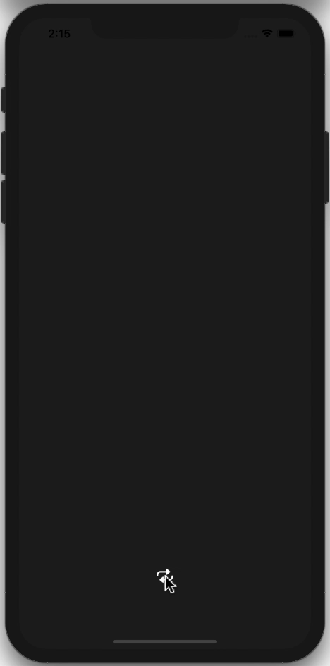

# AnimatedLogo

Experimenting with a 7x7 animated grid using Swift. 

**Technical Info:** \
Xcode12  project written in Swift 5.3 for iOS 14\
SpriteKit, SKScene, SKView, SKActions, SKLabelNode, SKNode

**See Also:** \
[Quickies - a variety of example iOS apps](https://github.com/PepperoniJoe/Quickies)\
 [Make Icons Swiftly - used to generate the app icon set for this app
 ](https://github.com/PepperoniJoe/Make-Icons-Swiftly)

**Author:** \
Marcy Vernon [@MarcyVernon](https://twitter.com/MarcyVernon)

**License:** \
"Animated Logo" is under the MIT license. See [LICENSE](/LICENSE) for more information.
